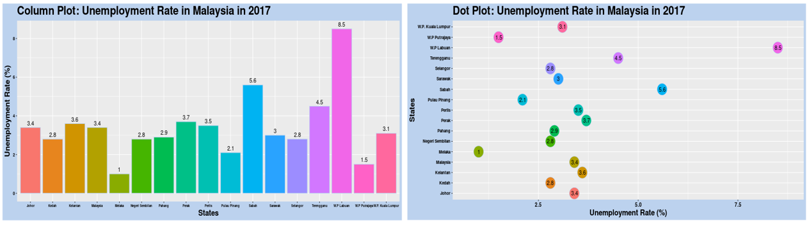
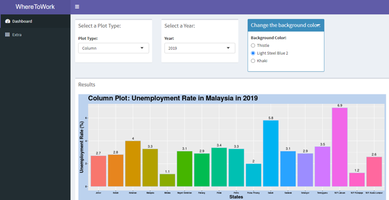

WhereToWork
========================================================
author: 
date: 
autosize: true

## Unemployment Rate by State from 2017-2019 in Malaysia

<small>NUR AMNI BAHIRAH BINTI AB WAHIT (17152918/1)  
SITI KHALIDAH BINTI A RAMLI (17099776/1)  
MAISARAH BINTI MAIZUL LIZAN (17206792/1)  
MUHAMMAD ASYRAF BIN MUSTAFFA (17206591/2)</small>  

Introduction
========================================================
Nowadays, the number of unemployed people in this country has become increasingly worrisome among Malaysians. In this project, we are going to explore and analyse which state has the highest and lowest unemployment rate in Malaysia from 2017 to 2019 based on the dataset we found. Not only that, we will also analyse the changes and differences in the rate for each state for the past three years.

## Question  

* Which state has the highest and lowest unemployment rate from 2017 to 2019?

Dataset
========================================================
The shiny app analysis open data was gotten from the **data.gov.my** web site. This data set shows unemployment rate by state in Malaysia for year 1982 until 2019. The statistics is derived from Labour Force Survey (LFS). 

Source of the data set is:  <a href="https://www.data.gov.my/data/en_US/dataset/labour-force-statistics-malaysia-1092/resource/535d70a3-2697-4007-b013-93fd6d33659e"" target="_blank">Dataset</a>

Link to the GitHub: <a href="https://github.com/amniwahit/GroupProject.git" target="_blank">Github</a>

## Target

* Unemployed People
* Fresh Graduate

Data Story
========================================================
For each data grouping the following information was graphed:
* Column
* Dot Plot

Data Product
========================================================
Sample of Data Product :  

<a href="https://maisarrh.shinyapps.io/WhereToWork/" target="_blank">Run the Apps</a>

